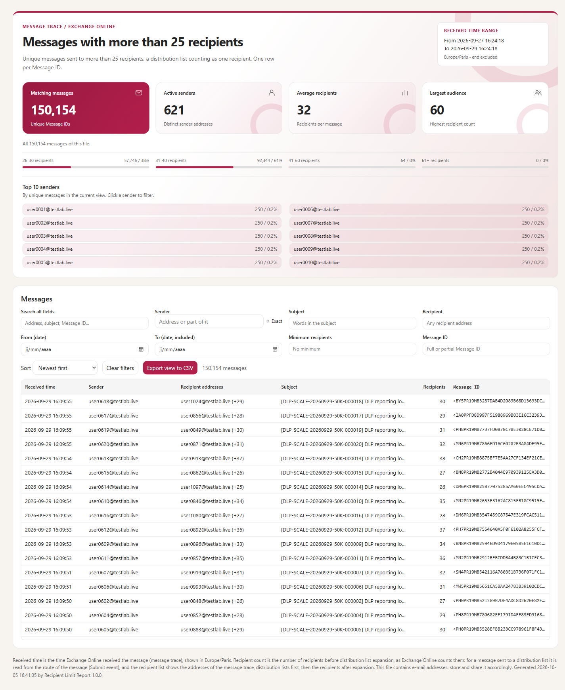
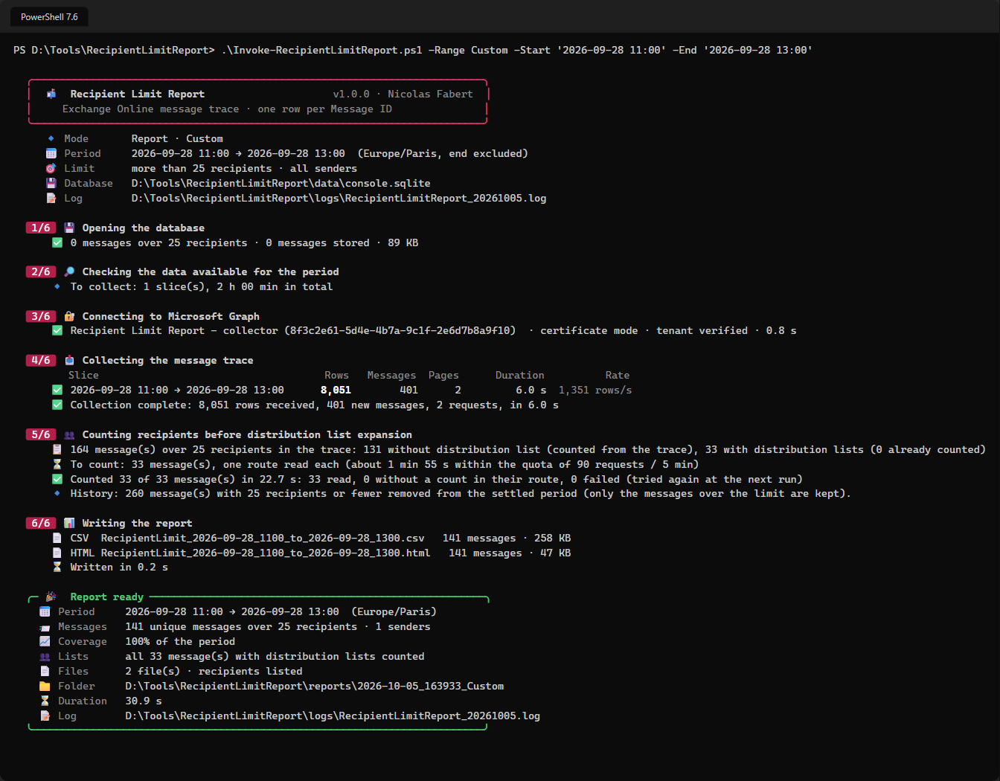

# Recipient Limit Report

Reports the Exchange Online messages sent to **more than 25 recipients** — counted as Exchange Online counts them, a distribution list being one recipient — as CSV and HTML files, **one row per Message ID**.

> [!IMPORTANT]
> Files downloaded from the Internet may be blocked by Windows and fail to run. Before using this project, unblock every file in the downloaded folder:
>
> ```powershell
> Get-ChildItem "C:\Chemin\Du\Dossier" -Recurse -File -Force | Unblock-File
> ```
>
> Replace the example path with the folder where you downloaded or extracted this project.
>
> The `Install-Module` commands in this documentation use `-Force`, so they also update or reinstall a module that is already installed. If an older version still conflicts, close every PowerShell window, open a new one (as administrator for `-Scope AllUsers`), run `Uninstall-Module <ModuleName> -AllVersions -Force`, then run the `Install-Module` command again.



## Why

To reduce the volume of e-mail, organisations often want to limit the messages sent to a large audience. The measure is applied by a recipient limit per mailbox (`Set-Mailbox -RecipientLimits`) or by a DLP policy. In both cases the business lines need to see **which messages are concerned** — who sends, to whom, about what, when — and the administrators need facts to maintain the **exception list**. This tool produces that report from the message trace, **without any DLP policy**: it is the report of [Purview DLP Report](https://github.com/Nico77600/PurviewDlpReport), with another source.

## How it works

```
Message trace  ──►  local SQLite history  ──►  CSV + HTML report
(Microsoft Graph,     (beyond the 90 days       (one row per Message ID,
 every recipient)      of the message trace)     local files only)
```

- **Source**: the Exchange Online message trace (Microsoft Graph `messageTraces`), optionally limited to the senders of the accepted domains, within the tenant quota of 100 requests per 5 minutes.
- **History**: a local SQLite database keeps what the message trace forgets after 90 days — only the messages over the limit. Collections are restartable, never store a message twice, and re-read the last hours to catch late rows.
- **Count**: a distribution list is one recipient, as for `RecipientLimits` and DLP. For a message sent to a list, the count and the recipients as the sender addressed them are read from the route of the message.
- **Report**: one row per unique Message ID — received time, sender, recipients (optional), subject, recipient count, distribution lists, Message ID — as CSV and a self-contained HTML file with filters, Top 10 senders and message details. Large periods are split by day, week or number of rows.
- **Read-only** for Microsoft 365: the tool never sends e-mail and never changes a setting.



## Requirements

| Item | Requirement |
|---|---|
| PowerShell | 7.4 or later |
| Module | None with a certificate; `Microsoft.Graph.Authentication` for the interactive sign-in |
| Console | Windows Terminal (emoji and colours) |
| Permissions | Microsoft Graph `ExchangeMessageTrace.Read.All`. For unattended runs: an application with a certificate and this application permission, and the service principal of the message trace service in the tenant (guide, chapter 7) |
| SQLite | Bundled in `lib\sqlite` — nothing to install |

## Quick start

```powershell
git clone https://github.com/Nico77600/RecipientLimitReport.git
cd RecipientLimitReport
notepad .\config\RecipientLimitReport.config.psd1      # TenantId, application, sender domains

.\Invoke-RecipientLimitReport.ps1 -Mode Status          # checks the configuration, no connection
.\Invoke-RecipientLimitReport.ps1                       # report of the last 7 days
.\Invoke-RecipientLimitReport.ps1 -Range PreviousMonth  # previous calendar month
.\Invoke-RecipientLimitReport.ps1 -Mode Collect         # daily collection (scheduled task)
```

The message trace keeps 90 days: schedule the daily collection. The zip of each [release](https://github.com/Nico77600/RecipientLimitReport/releases) contains only the files needed to run.

## Documentation

The **administrator guide** covers installation, configuration, unattended execution with a certificate, the count before distribution list expansion, the report, troubleshooting and the internals:

- [docs/RecipientLimitReport-Guide.md](docs/RecipientLimitReport-Guide.md)
- `docs/RecipientLimitReport-Guide.html` — the same guide as a single HTML file (download it and open it locally)

## Same report as Purview DLP Report

[**Purview DLP Report**](https://github.com/Nico77600/PurviewDlpReport) produces the same report from a DLP policy in audit mode (Activity Explorer). This tool reads the message trace instead: no DLP policy is needed, and the messages refused by `RecipientLimits` — refused before any DLP rule — are still reported. In the lab, both reports list the same messages with the same recipient counts, distribution lists included.

## Tests

```powershell
Invoke-Pester -Path .\tests      # Pester 5, no connection to Microsoft 365
```

## License

[MIT](LICENSE). The bundled SQLite components keep their own licenses: see [THIRD-PARTY-NOTICES.md](THIRD-PARTY-NOTICES.md).

## Disclaimer

Personal project, provided as is. It is not an official Microsoft product and is not supported by Microsoft. Test it in your environment before production use.
