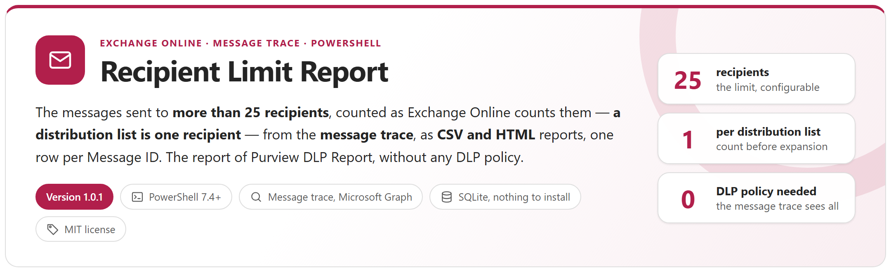
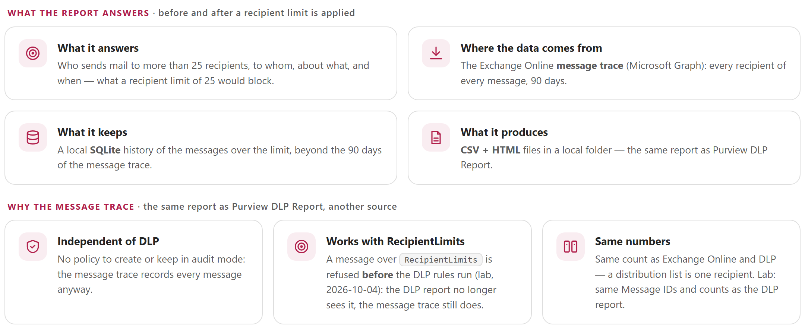
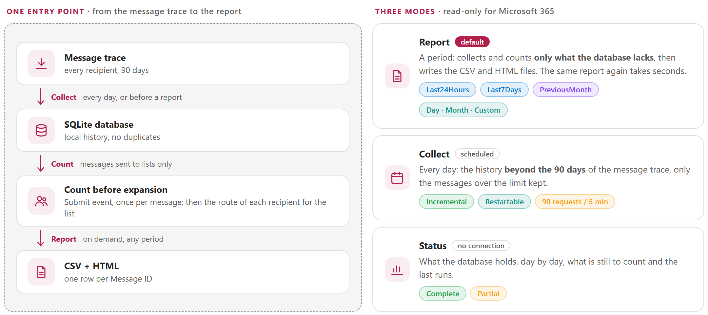
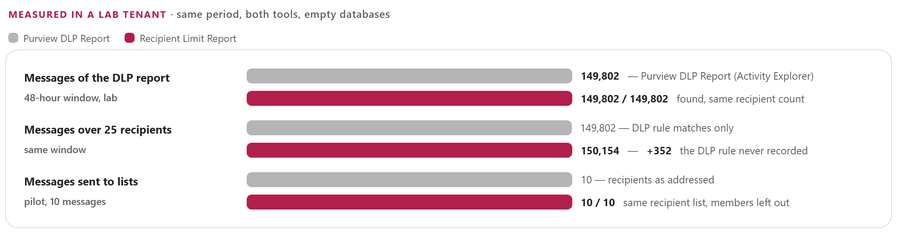
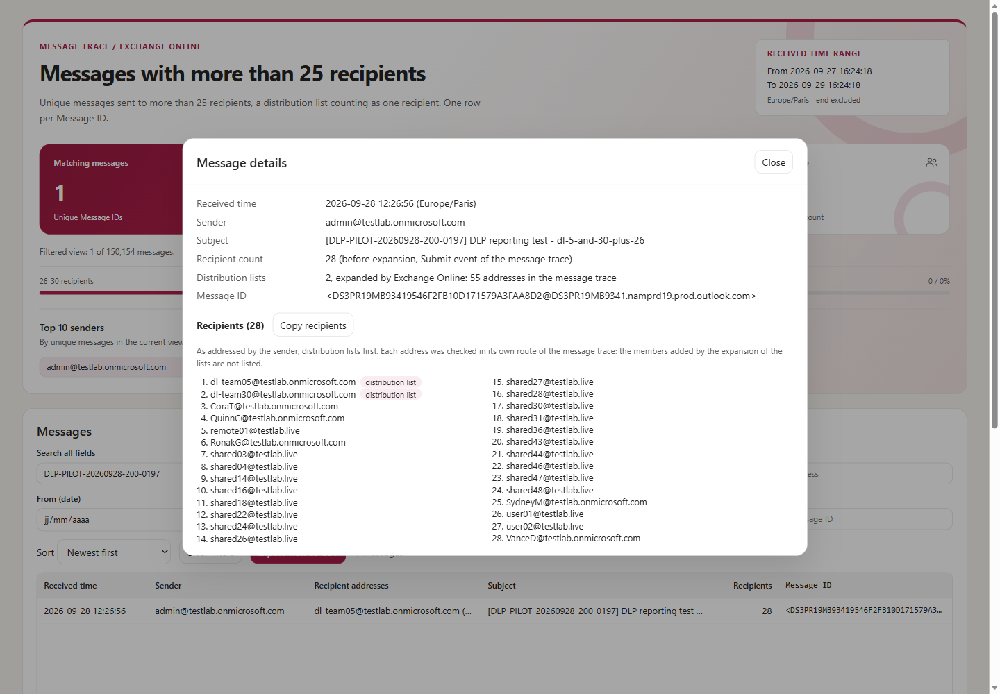
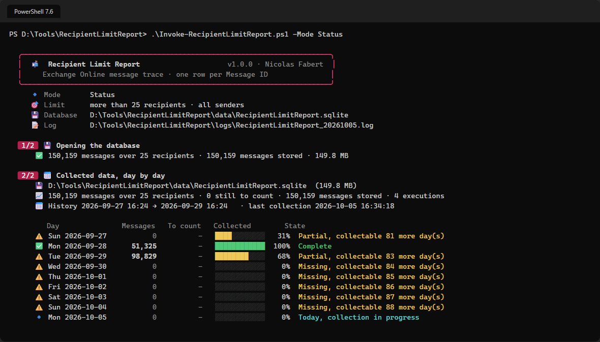

<p align="center">
  <picture>
    <source media="(prefers-color-scheme: dark)" srcset="package/docs/images/readme-banner-dark.png">
    
  </picture>
</p>

<p align="center">
  <a href="#why"><b>Why</b></a> &nbsp;&middot;&nbsp;
  <a href="#how-it-works"><b>How it works</b></a> &nbsp;&middot;&nbsp;
  <a href="#same-report-as-purview-dlp-report"><b>Same report as Purview DLP Report</b></a> &nbsp;&middot;&nbsp;
  <a href="#reports"><b>Reports</b></a> &nbsp;&middot;&nbsp;
  <a href="#quick-start"><b>Quick start</b></a> &nbsp;&middot;&nbsp;
  <a href="package/docs/RecipientLimitReport-Guide.md"><b>Administrator guide</b></a>
</p>

> [!IMPORTANT]
> Files downloaded from the Internet may be blocked by Windows and fail to run. Before using this project, unblock every file in the downloaded folder:
>
> ```powershell
> Get-ChildItem "C:\Chemin\Du\Dossier" -Recurse -File -Force | Unblock-File
> ```
>
> Replace the example path with the folder where you downloaded or extracted this project.
>
> The `Install-Module` commands in this documentation use `-Force`, so they also update or reinstall a module that is already installed. If an older version still conflicts, close every PowerShell window, open a new one (as administrator for `-Scope AllUsers`), run `Uninstall-Module <ModuleName> -AllVersions -Force`, then run the `Install-Module` command again.

## Why

To reduce the volume of e-mail, organisations often want to limit the messages sent to a large audience — for example to **more than 25 recipients**, except for the users of an **exception list**. The limit is applied per mailbox (`Set-Mailbox -RecipientLimits`) or by a DLP policy. In both cases the business lines need to see **which messages are concerned** — who sends, to whom, about what, when — and the administrators need facts to maintain the exception list.

[Purview DLP Report](https://github.com/Nico77600/PurviewDlpReport) answers it from a DLP policy in audit mode. This tool produces **the same report from the message trace**, without any DLP policy — and keeps seeing the messages once `RecipientLimits` refuses them, before any DLP rule runs.

<picture>
  <source media="(prefers-color-scheme: dark)" srcset="package/docs/images/readme-principles-dark.png">
  
</picture>

## How it works

<picture>
  <source media="(prefers-color-scheme: dark)" srcset="package/docs/images/readme-how-it-works-dark.png">
  
</picture>

- **The whole message trace is read** (Microsoft Graph `messageTraces`): the API cannot filter on a number of recipients. `Target.SenderDomains` limits the reading to the senders of the organisation. One shared rolling budget of 90 requests per 5 minutes (configurable), `Retry-After` honoured, token renewed — the quota of the tenant, not the server, sets the pace: about **90,000 rows per minute**.
- **Page by page into SQLite**: Ctrl+C or a failure keeps what was received; the next run collects only the rest. The last hours, which may still change, are read again. Once a period has settled, only the messages over the limit are kept.
- **A distribution list is one recipient**, as for `RecipientLimits` and the DLP condition. For a message sent to a list, the count before expansion is read from the **Submit event** of its route, and the recipient list as the sender addressed it is rebuilt from the route of each recipient: the members added by the expansion are left out.
- **The report of Purview DLP Report**: one row per Message ID — received time, sender, recipients (optional), subject, recipient count, distribution lists, Message ID — in CSV and a self-contained HTML file. Large periods are split by day, week or number of rows.
- **Read-only**, one permission (`ExchangeMessageTrace.Read.All`), certificate authentication built in — no module to install, SQLite bundled.

## Same report as Purview DLP Report

Both tools on the same 48-hour window of a lab tenant, from empty databases:

<picture>
  <source media="(prefers-color-scheme: dark)" srcset="package/docs/images/readme-benchmark-dark.png">
  
</picture>

The 352 messages more are messages over 25 recipients that the DLP rule never evaluated, or blocked without any event in Activity Explorer: the message trace records every message. On 7 days of a load test (13.2 million trace rows), a run from an empty database took **3 h 03 min** for **400,139 messages over 25 recipients**; the daily collection then reads one day at a time.

## Reports

<table>
  <tr>
    <td width="50%" valign="top"><a href="package/docs/images/report-overview.png"></a><br><sub><b>HTML report</b> &middot; tiles, recipient count bands, Top 10 senders, filters and a virtual list of every message</sub></td>
    <td width="50%" valign="top"><a href="package/docs/images/report-details.png"></a><br><sub><b>A message</b> &middot; 28 recipients before expansion, the 2 distribution lists first, the members added by the expansion left out</sub></td>
  </tr>
  <tr>
    <td width="50%" valign="top"><a href="package/docs/images/console-report.png"></a><br><sub><b>Console</b> &middot; plan, Microsoft Graph, collection, count before expansion, files</sub></td>
    <td width="50%" valign="top"><a href="package/docs/images/console-status.png"></a><br><sub><b>Status</b> &middot; what the database holds, day by day, and what can still be collected</sub></td>
  </tr>
</table>

Each run writes a CSV file (one row per Message ID) and a self-contained HTML report that stays fast with 400,000 messages. Large periods are split by week, day or number of rows.

## Requirements

| Item | Requirement |
|---|---|
| PowerShell | 7.4 or later, Windows |
| Modules | None (certificate or secret). Interactive sign-in: `Microsoft.Graph.Authentication` |
| Permission | Microsoft Graph `ExchangeMessageTrace.Read.All` with admin consent |
| Tenant | The service principal of the Microsoft application `8bd644d1-64a1-4d4b-ae52-2e0cbf64e373` ([guide, chapter 7](package/docs/RecipientLimitReport-Guide.md#7-unattended-execution)) |
| Console | Windows Terminal (emoji and colours) |
| SQLite | Bundled in `lib\sqlite` — nothing to install |

## Quick start

```powershell
git clone https://github.com/Nico77600/RecipientLimitReport.git
cd RecipientLimitReport\package
notepad .\config\RecipientLimitReport.config.psd1      # TenantId, AppId, CertificateThumbprint, sender domains

.\Invoke-RecipientLimitReport.ps1 -Mode Status          # checks the configuration, no connection
.\Invoke-RecipientLimitReport.ps1                       # report of the last 7 days
.\Invoke-RecipientLimitReport.ps1 -Range PreviousMonth  # previous calendar month
.\Invoke-RecipientLimitReport.ps1 -Range Day -Date 2026-09-28 -IncludeRecipientDetails:$false
.\Invoke-RecipientLimitReport.ps1 -Mode Collect         # daily collection (scheduled task)
```

The message trace keeps 90 days: schedule the daily collection. The `package` folder of this repository holds exactly the files needed to run Recipient Limit Report, with the guide. The zip of each [release](https://github.com/Nico77600/RecipientLimitReport/releases) contains the same run-time files with the HTML guide; `.\tools\New-RlrPackage.ps1` builds that zip content from the repository.

## Documentation

The **administrator guide** covers the project background, the application registration with a certificate, every setting, the scheduled collection, the count before distribution list expansion, how to read the report, volume and duration, troubleshooting, the lab measurements and the internals:

- [package/docs/RecipientLimitReport-Guide.md](package/docs/RecipientLimitReport-Guide.md)
- `package/docs/RecipientLimitReport-Guide.html` — the same guide as a single HTML file (download it and open it locally)

## Tests

```powershell
Invoke-Pester -Path .\tests      # Pester 5+, in-memory message trace API, no connection to Microsoft 365
```

`tools\Build-Documentation.ps1` rebuilds the HTML guide; `tools\New-ReadmeImages.ps1` renders the graphics of this page from the guide, in a light and a dark version.

## License

[MIT](LICENSE). The bundled SQLite components keep their own licenses: see [THIRD-PARTY-NOTICES.md](package/THIRD-PARTY-NOTICES.md).

## Disclaimer

Personal project, provided as is. It is not an official Microsoft product and is not supported by Microsoft. Test it in your environment before production use.
